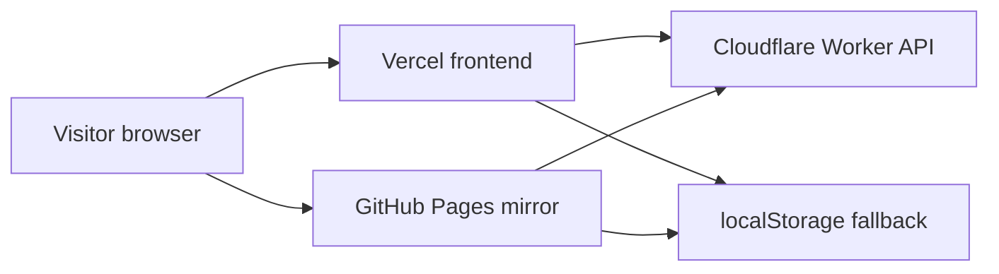

# AURA by AI_Nikitka93

[English](README.md) | [Русский](README.ru.md)

A public portfolio case for a premium smart-jewelry concept, built as a privacy-first React/Vite experience with a demo-safe backend path.

- Primary demo: https://aura-by-ai-nikitka93.vercel.app/
- GitHub Pages mirror: https://ai-nikitka93.github.io/AURA-by-AI_Nikitka93/
- Source app: [`Desaine/`](Desaine/)
- Worker/API surface: [`Desaine/worker/`](Desaine/worker/)
- Release runbook: [`RELEASE_RUNBOOK.md`](RELEASE_RUNBOOK.md)

## Preview


## What This Repository Is

AURA combines brand direction, UX copy, interaction design, and a real frontend implementation into one repository. It is packaged as a public showcase, not as an open-source starter or reusable component kit.

Use this repo if you want to inspect:
- a premium marketing-style React landing page with a standalone `privacy.html`
- a consent-aware personalization flow with local fallback state
- a dual-hosted frontend surface: Vercel as the primary demo and GitHub Pages as the public mirror
- a Cloudflare Worker integration path for demo-safe waitlist and AI flows

## Quickstart

```bash
cd "Desaine"
npm ci
npm run dev
```

Open `http://localhost:5173`.

### Build and Preview

```bash
npm run build
npm run preview
```

Preview runs at `http://localhost:4173`.

### Visual Tests

```bash
npx playwright install chromium
npm run test:visual
```

## Runtime Surfaces



## Deployment Paths

| Surface | Role | Source of truth |
| --- | --- | --- |
| Vercel | Primary public demo | `Desaine/` production deploy |
| GitHub Pages | Public mirror tied to `main` | `.github/workflows/deploy-github-pages.yml` |
| Cloudflare Worker | Demo-safe API/backend path | `Desaine/worker/index.js` |

## Highlights

- Hero, benefits, case study, founder, FAQ, and CTA sections
- Ritual configurator plus guided advisor
- Email signup flow with explicit privacy consent and demo-mode queue fallback
- Standalone `privacy.html` and an in-app privacy control center
- Playwright visual coverage and release runbook documentation

## Repository Map

| Path | Purpose |
| --- | --- |
| `Desaine/src/` | Application source, sections, hooks, and UI primitives |
| `Desaine/public/` | Static assets and manifest-related files |
| `Desaine/privacy.html` | Standalone privacy policy page |
| `Desaine/worker/` | Worker API, origin checks, and AI relay logic |
| `docs/` | Runbooks, packaging audit, state, and history |
| `.github/workflows/` | GitHub Pages deployment automation |

## Documentation and Support

- Packaging audit and README plan: [`docs/REPOSITORY_PACKAGING_AUDIT.md`](docs/REPOSITORY_PACKAGING_AUDIT.md)
- Release runbook: [`RELEASE_RUNBOOK.md`](RELEASE_RUNBOOK.md)
- Implementation history: [`docs/PROJECT_HISTORY.md`](docs/PROJECT_HISTORY.md)
- Current maintainer state: [`docs/STATE.md`](docs/STATE.md)
- Contribution guide: [`CONTRIBUTING.md`](CONTRIBUTING.md)
- Support policy: [`SUPPORT.md`](SUPPORT.md)
- Security policy: [`SECURITY.md`](SECURITY.md)
- Code of conduct: [`CODE_OF_CONDUCT.md`](CODE_OF_CONDUCT.md)

## Contribution Posture

The repository is public for review and portfolio visibility, but it is not open source. Contributions are welcome in the form of issues, documentation clarifications, and narrowly scoped pull requests that respect the existing product direction.

## License

This repository is published as a proprietary all-rights-reserved showcase. See [LICENSE](LICENSE).
