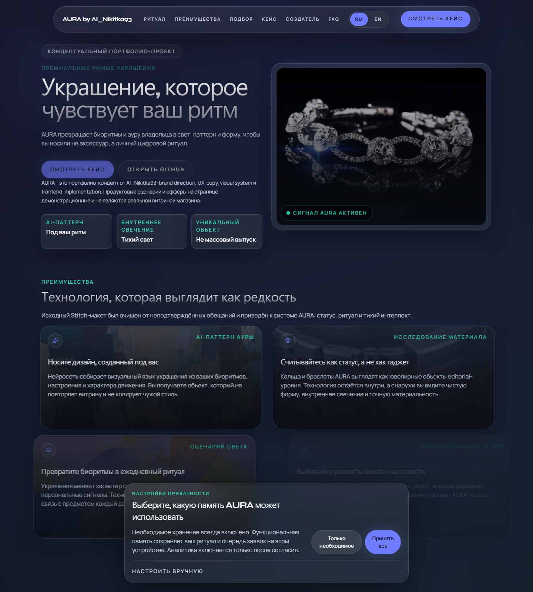
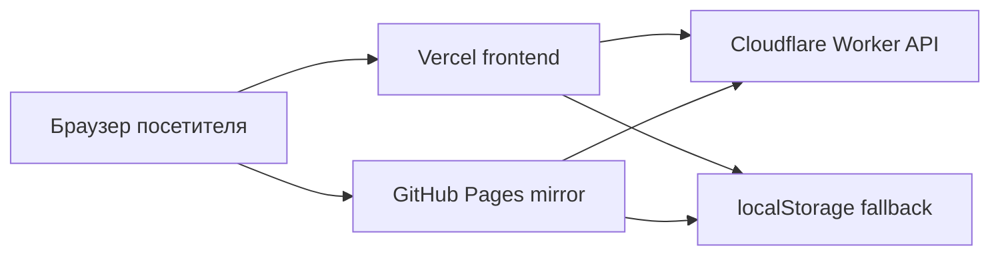

# AURA by AI_Nikitka93

[English](README.md) | [Русский](README.ru.md)

Публичный портфолио-кейс premium smart-jewelry концепта, собранный как privacy-first React/Vite experience с demo-safe backend path.

- Основной демо-URL: https://aura-by-ai-nikitka93.vercel.app/
- GitHub Pages mirror: https://ai-nikitka93.github.io/AURA-by-AI_Nikitka93/
- Исходное приложение: [`Desaine/`](Desaine/)
- Worker/API surface: [`Desaine/worker/`](Desaine/worker/)
- Release runbook: [`RELEASE_RUNBOOK.md`](RELEASE_RUNBOOK.md)

## Preview



## Что Это За Репозиторий

AURA объединяет brand direction, UX copy, interaction design и реальную frontend-реализацию в одном репозитории. Это public showcase, а не open-source starter и не reusable component kit.

Репозиторий полезен, если нужно посмотреть:
- premium marketing-style React landing page с отдельным `privacy.html`
- consent-aware personalization flow с локальным fallback state
- dual-hosted frontend surface: Vercel как основной demo URL и GitHub Pages как публичный mirror
- Cloudflare Worker integration path для demo-safe waitlist и AI flows

## Быстрый Старт

```bash
cd "Desaine"
npm ci
npm run dev
```

Открой `http://localhost:5173`.

### Сборка И Preview

```bash
npm run build
npm run preview
```

Preview поднимается на `http://localhost:4173`.

### Visual Tests

```bash
npx playwright install chromium
npm run test:visual
```

## Runtime Surfaces



## Пути Деплоя

| Surface | Роль | Source of truth |
| --- | --- | --- |
| Vercel | Основной публичный demo URL | production deploy из `Desaine/` |
| GitHub Pages | Публичный mirror, привязанный к `main` | `.github/workflows/deploy-github-pages.yml` |
| Cloudflare Worker | Demo-safe API/backend path | `Desaine/worker/index.js` |

## Ключевые Возможности

- Hero, benefits, case study, founder, FAQ и CTA sections
- Ritual configurator и guided advisor
- Email signup flow с явным privacy consent и demo-mode queue fallback
- Отдельный `privacy.html` и встроенный privacy control center
- Playwright visual coverage и release runbook documentation

## Карта Репозитория

| Путь | Назначение |
| --- | --- |
| `Desaine/src/` | Исходники приложения, секции, hooks и UI-примитивы |
| `Desaine/public/` | Статические assets и manifest-related файлы |
| `Desaine/privacy.html` | Отдельная страница privacy policy |
| `Desaine/worker/` | Worker API, origin checks и AI relay logic |
| `docs/` | Runbooks, packaging audit, state и history |
| `.github/workflows/` | Автоматизация деплоя в GitHub Pages |

## Документация И Поддержка

- Packaging audit и README plan: [`docs/REPOSITORY_PACKAGING_AUDIT.md`](docs/REPOSITORY_PACKAGING_AUDIT.md)
- Release runbook: [`RELEASE_RUNBOOK.md`](RELEASE_RUNBOOK.md)
- История реализации: [`docs/PROJECT_HISTORY.md`](docs/PROJECT_HISTORY.md)
- Текущее состояние проекта: [`docs/STATE.md`](docs/STATE.md)
- Contribution guide: [`CONTRIBUTING.md`](CONTRIBUTING.md)
- Support policy: [`SUPPORT.md`](SUPPORT.md)
- Security policy: [`SECURITY.md`](SECURITY.md)
- Code of conduct: [`CODE_OF_CONDUCT.md`](CODE_OF_CONDUCT.md)

## Contribution Posture

Репозиторий публичный для обзора и как portfolio surface, но не является open-source. Наиболее полезные формы вклада здесь — issues, документационные правки и узкие PR без переписывания продуктового направления.

## Лицензия

Репозиторий опубликован как proprietary all-rights-reserved showcase. См. [LICENSE](LICENSE).
