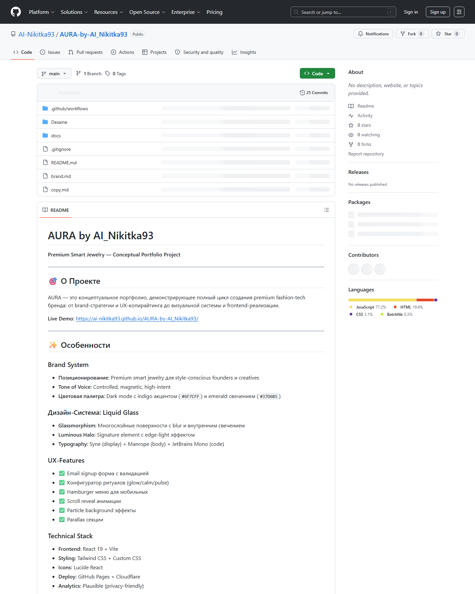

# Repository Packaging Audit

Audit date: 2026-04-06

## Captured Surfaces

### Live site

Full-page capture: [`docs/screenshots/site-live-home.png`](screenshots/site-live-home.png)

### Public GitHub repository

Full-page capture: [`docs/screenshots/github-repo-page.png`](screenshots/github-repo-page.png)

## Verdict

The live site looks visually strong and product-like. The hero, typography, CTA hierarchy, and overall atmosphere communicate the concept well enough for a portfolio surface.

The public GitHub repository is not fully packaged yet on the remote side. The captured GitHub screenshot still shows the previous README, and the repository header lacks description, website, and topics. This means the website feels more finished than the repository landing page.

## What Looks Good

- The live site has a clear premium mood and readable hero section.
- The README rewrite now gives a cleaner quickstart and repo map locally.
- The repo has a real deploy workflow and a maintainable app structure under `Desaine/`.

## Remaining Gaps

- The new README and community files are only local until committed and pushed.
- The GitHub About panel is empty on the public repo.
- There is still no explicit `LICENSE` file, so the trust surface is clear but not open-source ready.
- A screenshot of the site exists now, but the public repo page will not show it until the updated README is pushed.
